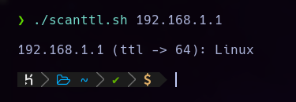

# SCANTTL
### Small bash script to detect the type of machine through the TTL value.



Use:
```
scanttl.sh <ip_address>
```
Example:
```
./scanttl.sh 192.168.1.250
```
Assign execute permissions before use:
```
chmod +x scanttl.sh
```


